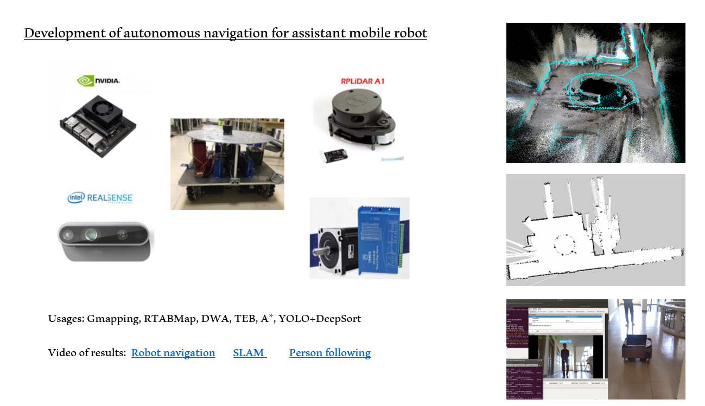

# Mobile robot project

## Introduction
This resource includes all the necessary code for implementing the navigation stack and person tracking on a four-wheel mecanum mobile robot in both the ROS/Gazebo simulation environment and the real world.

The robot can do following tasks:
1. SLAM: Gmapping and RTABMAP
2. Path planning and following: A*, DWA*
3. Person tracking: YOLOv4/SSD MobileNet + DeepSORT

Hardwares:
1. 3D camera: Realsense D435i
2. Lidar: Rplidar A1
3. NVIDIA Jeson Xavier NX

## Results
1. RTABMAP for 3D Mapping. Link youtube (https://youtu.be/6_P0vyS4N2I)
2. Robot naviagtion: Gmapping, A*, DWA. Link youtube (https://youtu.be/okjhm3c1e0w)
3. Person tracking: YOLOv4+DeppSort. Link youtube (https://youtu.be/4MV78j0H5VI)

